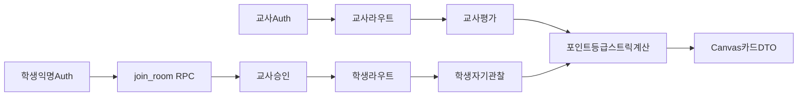

# v1 기반 아키텍처

## 경계

- 교사는 Supabase 이메일 Auth의 정식 사용자다.
- 학생은 회원가입 화면 없이 Supabase anonymous Auth 세션을 사용한다.
- 익명 세션은 6자리 방 코드로 `join_room()` RPC를 호출하고 `students.status = pending` 상태로 생성된다.
- 교사가 학생을 승인하면 해당 방의 평가·카드·상점 데이터에 접근할 수 있다.
- 브라우저는 publishable key만 사용한다. service-role key는 현재 기반과 클라이언트 코드에 두지 않는다.

## 데이터 흐름

## 권한 확인 위치

1. `proxy.ts`는 세션 쿠키를 갱신하고 보호 경로의 무세션 접근을 돌려보낸다.
2. Server Component는 `requireTeacher()` 또는 `requireStudent()`로 실제 JWT와 DB 역할을 다시 확인한다.
3. 모든 데이터 접근은 RLS를 최종 권한 경계로 사용한다.
4. 가격·한도·잔액처럼 경쟁 상태가 생기는 구매 로직은 클라이언트가 아니라 후속 원자적 RPC에서 처리한다.

## Storage 경로

카드 이미지는 `card-art/{room_id}/{grade}/{file}` 형식을 사용한다. 버킷은 비공개이며 방 교사만 쓰고 승인된 방 구성원만 읽는다.

## 다음 구현 단위

기반 구축 이후 첫 세로 기능은 `교사 가입·로그인 → 방 생성 → 수업일 생성 → 학생 코드 입장 → 교사 승인`이다. 카드, 상점, 차트는 이 흐름이 RLS 테스트를 통과한 뒤 이식한다.
