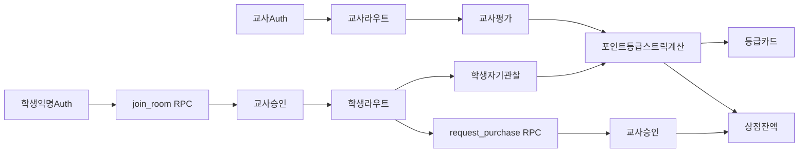

# v1 기반 아키텍처

## 경계

- 교사는 Supabase 이메일 Auth의 정식 사용자다.
- 학생은 회원가입 화면 없이 Supabase anonymous Auth 세션을 사용한다.
- 익명 세션은 6자리 방 코드로 `join_room()` RPC를 호출하고 `students.status = pending` 상태로 생성된다.
- 교사가 학생을 승인하면 해당 방의 평가·카드·상점 데이터에 접근할 수 있다.
- 브라우저는 publishable key만 사용한다. service-role key는 현재 기반과 클라이언트 코드에 두지 않는다.

## 데이터 흐름

## 권한 확인 위치

1. `proxy.ts`는 세션 쿠키를 갱신하고 보호 경로의 무세션 접근을 돌려보낸다.
2. Server Component는 `requireTeacher()` 또는 `requireStudent()`로 실제 JWT와 DB 역할을 다시 확인한다.
3. 모든 데이터 접근은 RLS를 최종 권한 경계로 사용한다.
4. 구매 한도·중복 pending·잔액은 `request_purchase` RPC에서 학생 행을 잠근 뒤 원자적으로 검사한다. 잔액은 일일 기본 포인트 + `bonus_events` − (승인+대기 구매)다.
5. 조커·성장·회복 보너스는 각각 `joker_events` / `bonus_events` 원장과 sync RPC로 적재한다.

## Storage 경로

카드 이미지는 `card-art` 버킷 안의 `{room_id}/{grade}/{file}` 경로를 사용한다. 버킷은 비공개이며 방 교사만 쓰고 승인된 방 구성원만 읽는다. UI는 signed URL로 미리보기를 제공한다.

## 현재 구현 경계

`교사 가입·로그인 → … → PWA 설치 → v0 JSON 가져오기`까지 연결되어 있다.
